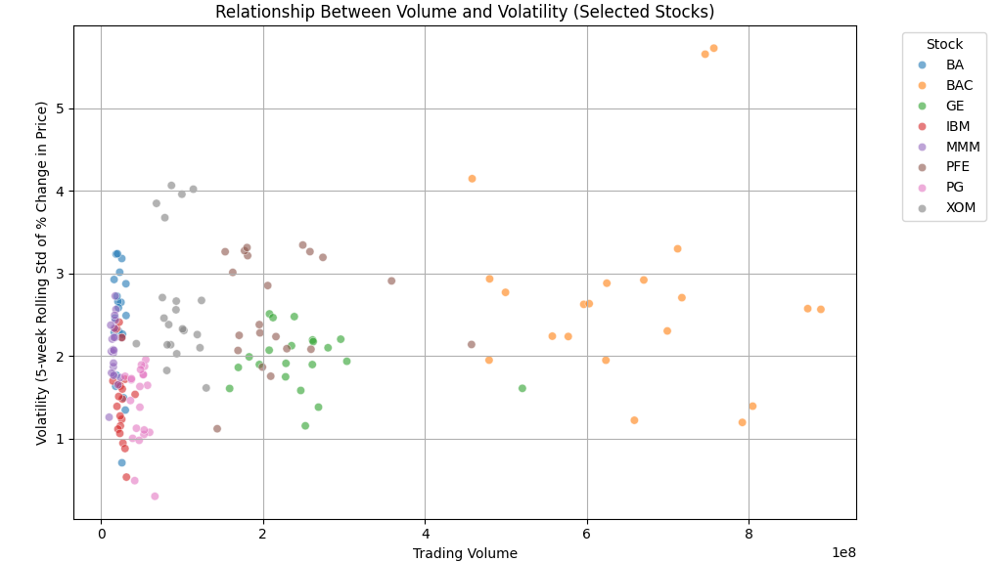

# Final Project  
**Analyzing the Relationship Between Volume and Volatility in Selected Dow Jones Stocks**  

## Introduction  
In financial markets, understanding the dynamics between trading volume and volatility is crucial for traders and investors. Trading volume refers to the total number of shares exchanged during a specific period, while volatility measures the extent of price fluctuations in a stock over time. These two factors are often interconnected—when market uncertainty rises, trading activity typically spikes, which in turn can lead to greater price swings. As such, recognizing a relationship between volume and volatility can offer valuable insights into market sentiment, potentially helping market participants anticipate future price movements and trends. This project focuses on examining the correlation between trading volume and volatility for a selection of Dow Jones Industrial Average (DJIA) stocks, aiming to quantify and better understand how these two variables interact.

To explore this relationship, Pearson correlation analysis is applied, a statistical method used to measure the strength and direction of the linear relationship between two variables. The Pearson correlation coefficient (r) ranges from -1 to +1, where a value closer to +1 indicates a strong positive correlation, -1 suggests a strong negative correlation, and 0 implies no linear relationship. By applying this method to the daily trading volume and volatility data of selected DJIA stocks, this project investigates whether an increase in trading volume corresponds to an increase in price volatility. A significant positive correlation could suggest that higher trading volumes are indicative of heightened market uncertainty, while a weak or no correlation would challenge this assumption. Understanding the results of this analysis could help investors recognize early signs of potential market instability and adjust their strategies accordingly.

## Data  
The dataset used in this project is the Dow Jones Index data, which includes daily stock data for multiple companies.  

### Data Overview:
- **Features:**  
  - `date`: The trading date.  
  - `close`: The closing price of the stock.  
  - `volume`: The trading volume in shares.  
  - `stock`: The ticker symbol for the stock.  

### Preprocessing Steps:  
1. Converted `date` to datetime format for proper time-series handling.  
2. Removed invalid or missing data entries for cleaner analysis.  
3. Calculated the **percentage change** in daily closing prices to normalize stock price data.  
4. Computed the **5-day rolling standard deviation** of percentage change to estimate volatility.  
5. Filtered data to include only the selected stocks (`BAC`, `INTC`, `PG`, `GE`, `MMM`, `XOM`, `BA`, `IBM`, and `PFE`).  

### Visualization:  
The scatter plot below shows the relationship between trading volume and volatility for the selected stocks.  

**Figure 1:** Relationship Between Volume and Volatility (Selected Stocks).  

  

## Modeling  
In this project, the relationship between trading volume and volatility was analyzed using **Pearson correlation analysis**. Pearson's correlation coefficient is a widely-used statistic to measure the strength and direction of the linear relationship between two continuous variables. The formula for Pearson's correlation is given by:

\[
r = \frac{n \sum{xy} - \sum{x}\sum{y}}{\sqrt{(n \sum{x^2} - (\sum{x})^2)(n \sum{y^2} - (\sum{y})^2)}}
\]

Where:
- \(r\) is the Pearson correlation coefficient,
- \(x\) and \(y\) are the individual sample points for volume and volatility,
- \(n\) is the number of data points.

The value of \(r\) can range from -1 to 1:
- \(r = 1\) indicates a perfect positive linear correlation (as one variable increases, the other increases),
- \(r = -1\) indicates a perfect negative linear correlation (as one variable increases, the other decreases),
- \(r = 0\) suggests no linear correlation between the variables.

A positive correlation between trading volume and volatility would suggest that as market activity increases (reflected in volume), the price fluctuations (volatility) tend to rise as well. A negative correlation would indicate that higher trading volumes correspond to lower volatility. In this analysis, a positive correlation is expected based on the general behavior of stock markets during periods of high uncertainty.

To measure the significance of the correlation, a **p-value** is computed. The p-value helps determine whether the observed correlation is statistically significant or if it occurred by chance. Typically, if the p-value is less than 0.05, the correlation is considered statistically significant, suggesting a real relationship between the variables.

The Python code below performs the Pearson correlation analysis and generates relevant statistical outputs:

```python
from scipy.stats import pearsonr

# Calculate Pearson correlation
correlation, p_value = pearsonr(dow_data['volume'], dow_data['volatility'])

# Output the results
print(f"Pearson Correlation Coefficient: {correlation:.3f}")
print(f"P-value: {p_value:.3e}")
```

## Results  
After conducting the Pearson correlation analysis and regression, we obtained the following results:

- **Pearson Correlation Coefficient**: r = 0.291
- **P-value**: p = 1.895e-04

Interpretation of Results:
The results suggest a moderate, positive correlation between trading volume and volatility for the selected stocks. A correlation coefficient of 0.291 indicates that, in general, higher trading volumes tend to correspond with higher volatility, although the relationship is not perfect.

The p-value of 1.895e-04 is well below the commonly used threshold of 0.05, which indicates that the correlation is statistically significant. This means that the observed relationship between volume and volatility is unlikely to have occurred by chance and can be considered a real pattern in the data.

##Visualizing the Data:
In **Figure 2**, a regression analysis of volume vs. volatility is presented, where the relationship is captured by a regression line that helps visualize the trend.

**Figure 2:** Regression Analysis: Volume vs. Volatility.

## Discussion  
The findings of this project align with established financial theory, which posits that higher trading activity often occurs during periods of market uncertainty or heightened risk, leading to increased price fluctuations or volatility. This relationship is significant for traders and investors, as it could potentially signal an opportunity to anticipate market movements based on trading volume spikes.

### Interpretation of Figure 2:
The regression line in **Figure 2** illustrates the positive relationship between volume and volatility. The upward slope of the line reinforces the moderate positive correlation found in the statistical analysis. Outliers, which appear as points far from the regression line, may indicate abnormal market conditions or events such as earnings announcements or political news that can lead to sharp changes in both volume and volatility.


### Limitations:
- **Limited Sample Size**: The analysis focused on a subset of Dow Jones stocks, and not all stocks within the index were considered. A larger sample size could provide more robust insights.
- **External Factors**: The dataset does not account for external influences like economic news, geopolitical events, or corporate earnings reports that might significantly impact stock performance. These factors could be included in future analyses to improve the model's predictive power.
- **Data Granularity**: This project analyzes daily stock data. Higher-frequency data, such as minute-level data, might reveal different patterns and provide more actionable insights.

## Conclusion  
This analysis demonstrates that there is a statistically significant positive correlation between trading volume and volatility for the selected Dow Jones stocks. This finding suggests that trading activity could serve as an indicator of heightened market uncertainty, with higher volume typically reflecting increased price fluctuations. These insights could be valuable for investors and traders looking to understand market behavior and adjust their strategies accordingly.

### Key Findings:
- There is a statistically significant positive correlation between trading volume and volatility for the selected Dow Jones stocks.
- This relationship suggests that trading activity is a useful indicator of market uncertainty, as increased volume often occurs during periods of higher volatility.

## Future Work:
- **Broader Analysis**: Extend the analysis to include all Dow Jones stocks or additional indices for more comprehensive insights. This would provide a better understanding of how volume and volatility interact across different sectors and economic cycles.
- **External Factors**: Investigate how external events (e.g., earnings reports, geopolitical news) influence volume and volatility, and incorporate these factors into the analysis to improve the model's accuracy and predictive power.
- **Higher Frequency Data**: Consider using higher-frequency data (e.g., minute-level) to explore intraday patterns in trading volume and volatility. This could reveal short-term market behavior that may be missed with daily data.

---

**By Marilyn Logwood**  
