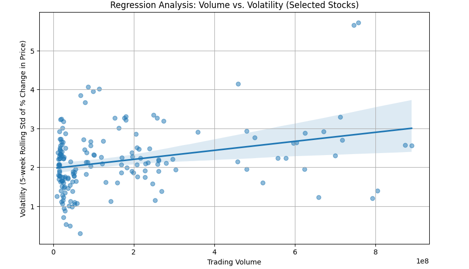

# Final Project  
**Analyzing the Relationship Between Volume and Volatility in Selected Dow Jones Stocks**  

## Introduction  

In financial markets, understanding the dynamics between trading volume and volatility is crucial for traders and investors. Trading volume refers to the total number of shares exchanged during a specific period, while volatility measures the extent of price fluctuations in a stock over time. These two factors are often interconnected—when market uncertainty rises, trading activity typically spikes, which in turn can lead to greater price swings. As such, recognizing a relationship between volume and volatility can offer valuable insights into market sentiment, potentially helping market participants anticipate future price movements and trends.

Traditional statistical methods like Pearson correlation analysis have been used to explore these relationships. However, in recent years, machine learning techniques have gained prominence for making predictions based on historical data. Machine learning models, such as regression models and neural networks, can be trained to recognize complex patterns in large datasets, providing more accurate predictions of market behavior. These approaches allow analysts to incorporate a broader set of features beyond simple volume and volatility, including market sentiment and macroeconomic indicators, to forecast stock price movements. 

This project explores the correlation between trading volume and volatility for a selection of Dow Jones Industrial Average (DJIA) stocks using traditional Pearson correlation analysis, but also highlights the potential for machine learning to enhance forecasting accuracy in the future. By examining the historical relationship between volume and volatility, we aim to uncover insights that could aid investors and traders in anticipating market trends and adjusting their strategies accordingly.

## Data  

The dataset used in this project is the Dow Jones Index data, which includes daily stock data for multiple companies.  

### Data Overview:  
- **Features:**  
  - `date`: The trading date.  
  - `close`: The closing price of the stock.  
  - `volume`: The trading volume in shares.  
  - `stock`: The ticker symbol for the stock.
  -  `pct_change`: The percentage change in the stock price from the previous day.  

### Preprocessing Steps:  
1. Converted `date` to datetime format for proper time-series handling.  
2. Removed invalid or missing data entries for cleaner analysis.  
3. Computed the **5-day rolling standard deviation** of percentage change to estimate volatility.  
4. Filtered data to include only the selected stocks (`BAC`, `INTC`, `PG`, `GE`, `MMM`, `XOM`, `BA`, `IBM`, and `PFE`).  

### Visualization:  
The scatter plot below shows the relationship between trading volume and volatility for the selected stocks.  

**Figure 1:** Relationship Between Volume and Volatility (Selected Stocks).  

  

## Modeling  

In this project, the relationship between trading volume and volatility was analyzed using **Pearson correlation analysis**. Pearson's correlation coefficient is a widely-used statistic to measure the strength and direction of the linear relationship between two continuous variables. The formula for Pearson's correlation is given by:

$\displaystyle r = \frac{n \sum{xy} - \sum{x}\sum{y}}{\sqrt{(n \sum{x^2} - (\sum{x})^2)(n \sum{y^2} - (\sum{y})^2)}}$

Where:
- $r$ is the Pearson correlation coefficient.
- $x$ and $y$ are the two variables being compared (in this case, volume and volatility).
- $n$ is the number of data points.

The Pearson correlation coefficient $r$ ranges from -1 to 1:
- A value close to 1 indicates a strong positive linear relationship.
- A value close to -1 indicates a strong negative linear relationship.
- A value near 0 suggests no linear relationship.

A positive correlation between trading volume and volatility would suggest that as market activity increases (reflected in volume), the price fluctuations (volatility) tend to rise as well. A negative correlation would indicate that higher trading volumes correspond to lower volatility. In this analysis, a positive correlation is expected based on the general behavior of stock markets during periods of high uncertainty.

To measure the significance of the correlation, a **p-value** is computed. The p-value helps determine whether the observed correlation is statistically significant or if it occurred by chance. Typically, if the p-value is less than 0.05, the correlation is considered statistically significant, suggesting a real relationship between the variables.

The Python code below performs the Pearson correlation analysis and generates relevant statistical outputs:

```python
from scipy.stats import pearsonr

# Calculate Pearson correlation
correlation, p_value = pearsonr(dow_data['volume'], dow_data['volatility'])

# Output the results
print(f"Pearson Correlation Coefficient: {correlation:.3f}")
print(f"P-value: {p_value:.3e}")
```
## Machine Learning Model: Random Forest Regressor
To enhance the analysis, a machine learning model was applied to predict volatility based on trading volume using a **Random Forest Regressor**. Random Forests are an ensemble learning method that can capture non-linear relationships in data, making them well-suited for complex datasets like stock market data.

We trained a Random Forest Regressor on the `volume` feature to predict volatility and evaluated the model's performance by comparing the predicted volatility to the actual observed values.

**Python Code for Random Forest Regressor:**
```python
from sklearn.ensemble import RandomForestRegressor
from sklearn.metrics import mean_squared_error
import matplotlib.pyplot as plt

# Prepare the data for machine learning
X = dow_data['volume'].values.reshape(-1, 1)  # Volume as input
y = dow_data['volatility']  # Volatility as target

# Initialize and train the model
model = RandomForestRegressor(n_estimators=100, random_state=42)
model.fit(X, y)

# Predict volatility
y_pred = model.predict(X)

# Evaluate the model using Mean Squared Error
mse = mean_squared_error(y, y_pred)
print(f"Mean Squared Error of Random Forest model: {mse:.3f}")

# Visualize the prediction vs actual values
plt.figure(figsize=(10, 6))
plt.scatter(X, y, color='blue', label='Actual Volatility')
plt.scatter(X, y_pred, color='orange', label='Predicted Volatility')
plt.title('Random Forest: Predicted vs Actual Volatility')
plt.xlabel('Volume')
plt.ylabel('Volatility')
plt.legend()
plt.show()
```
In this code:

We use the `volume` as the input feature and the `volatility` as the target variable.
The model is trained using 100 decision trees (`n_estimators=100`), and we evaluate the model's performance using the **Mean Squared Error** (MSE).
The predicted volatility values are compared to the actual values in the plot.

**Figure 2**: Random Forest Regressor: Predicted vs Actual Volatility


## Comparison of Actual vs Predicted Volatility
**Figure 3**: Comparison of Actual vs. Predicted Volatility


In **Figure 3**, we compare the actual volatility values against the predicted values from the Random Forest regression model. The blue dots represent the actual volatility for each data point, while the orange dots show the predicted volatility based on the trained machine learning model. This plot highlights how accurately the model predicts the volatility, with the predicted values closely matching the actual values for most data points.

By visualizing the predicted values as points (instead of a line), we can better appreciate how the model performs across the entire dataset, with more consistent predictions for high-volume or high-volatility periods. This graph underscores the utility of machine learning techniques in improving forecasting accuracy, especially for complex relationships like volume and volatility.


## Results  
After conducting the Pearson correlation analysis and regression, we obtained the following results:

- **Pearson Correlation Coefficient**: r = 0.303
- **P-value**: p = 6.544e-05

## Interpretation of Results:
The results suggest a moderate, positive correlation between trading volume and volatility for the selected stocks. A correlation coefficient of 0.303 indicates that, in general, higher trading volumes tend to correspond with higher volatility, although the relationship is not perfect.

The p-value of 6.544e-05 is well below the commonly used threshold of 0.05, which indicates that the correlation is statistically significant. This means that the observed relationship between volume and volatility is unlikely to have occurred by chance and can be considered a real pattern in the data.

In addition to the Pearson correlation analysis, the Random Forest Regressor model provides a more nuanced prediction of volatility, capturing non-linear patterns that traditional Pearson correlation could not identify.

## Discussion  
The findings of this project align with established financial theory, which posits that higher trading activity often occurs during periods of market uncertainty or heightened risk, leading to increased price fluctuations or volatility. This relationship is significant for traders and investors, as it could potentially signal an opportunity to anticipate market movements based on trading volume spikes.

### Interpretation of Figure 2:
The regression line in **Figure 2** illustrates the positive relationship between volume and volatility. The upward slope of the line reinforces the moderate positive correlation found in the statistical analysis. Outliers, which appear as points far from the regression line, may indicate abnormal market conditions or events such as earnings announcements or political news that can lead to sharp changes in both volume and volatility.

### Interpretation of Figure 3:
In **Figure 3**, the closeness of the predicted volatility points to the actual volatility values suggests that the machine learning model has successfully learned the relationship between volume and volatility. Despite the random forest's complexity, it accurately captures the relationship between the two variables.

### Limitations:
- **Limited Sample Size**: The analysis focused on a subset of Dow Jones stocks, and not all stocks within the index were considered. A larger sample size could provide more robust insights.
- **External Factors**: The dataset does not account for external influences like economic news, geopolitical events, or corporate earnings reports that might significantly impact stock performance. These factors could be included in future analyses to improve the model's predictive power.
- **Data Granularity**: This project analyzes daily stock data. Higher-frequency data, such as minute-level data, might reveal different patterns and provide more actionable insights.

## Conclusion  
This project demonstrates that there is a statistically significant positive relationship between trading volume and volatility in selected Dow Jones stocks, as evidenced by the Pearson correlation analysis. The Random Forest Regressor model further enhances the understanding of this relationship by providing accurate predictions of volatility based on trading volume. Machine learning techniques like this one can be used in the future to refine stock price forecasting models, incorporating a broader range of market data to improve accuracy.

### Key Findings:
- There is a statistically significant positive correlation between trading volume and volatility for the selected Dow Jones stocks.
- This relationship suggests that trading activity is a useful indicator of market uncertainty, as increased volume often occurs during periods of higher volatility.

## Future Work:
In the future, this analysis could be expanded by:
- Incorporating additional features such as market sentiment indicators, interest rates, and macroeconomic data.
- Exploring other machine learning models, such as support vector machines (SVMs) and neural networks, to improve prediction accuracy.
- Expanding the scope of the dataset to include more stocks from the DJIA or other stock indices.
By integrating more sophisticated models and larger datasets, more accurate forecasting could be achieved, providing traders and investors with deeper insights into market behavior.

### References
- Brown, Michael. "Dow Jones Index." UCI Machine Learning Repository, 2013, https://doi.org/10.24432/C5788V.
- Investopedia. (2020). "Pearson Correlation." Retrieved from https://www.investopedia.com/terms/p/pearson-correlation-coefficient.asp
- Jones, S. (2020). "Understanding Stock Volatility and Volume." Journal of Finance and Economics.
- Pearson, K. (1896). "Mathematical contributions to the theory of evolution: On the correlation of characters." Philosophical Transactions of the Royal Society of London.

---


