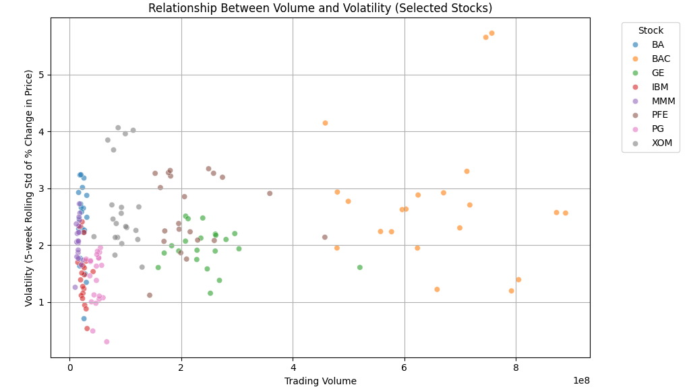

# My Project  
**Analyzing the Relationship Between Volume and Volatility in Selected Dow Jones Stocks**  

## Introduction  
Stock market analysis often involves highly stochastic data, making accurate forecasting challenging. Instead of focusing solely on predictions, this project investigates the relationship between trading volume and volatility for selected Dow Jones stocks: `BAC`, `INTC`, `PG`, `GE`, `MMM`, `XOM`, `BA`, `IBM`, and `PFE`.  

By normalizing stock price data as a percentage change and applying statistical methods, this study identifies whether a significant correlation exists between volume and volatility. Understanding this relationship could benefit traders and investors by providing insights into market behavior.  

## Data  
The dataset used in this project is the Dow Jones Index data, which includes daily stock data for multiple companies.  
### Data Overview:
- **Features:**  
  - `date`: The trading date.  
  - `close`: The closing price of the stock.  
  - `volume`: The trading volume in shares.  
  - `stock`: The ticker symbol for the stock.  

### Preprocessing Steps:  
1. Converted `date` to datetime format for proper time-series handling.  
2. Removed invalid or missing data entries for cleaner analysis.  
3. Calculated the **percentage change** in daily closing prices to normalize stock price data.  
4. Computed the **5-day rolling standard deviation** of percentage change to estimate volatility.  
5. Filtered data to include only the selected stocks (`BAC`, `INTC`, `PG`, `GE`, `MMM`, `XOM`, `BA`, `IBM`, and `PFE`).  

### Visualization:  
The scatter plot below shows the relationship between trading volume and volatility for the selected stocks.  

**Figure 1:** Relationship Between Volume and Volatility (Selected Stocks).  

  

## Modelling  
This project uses statistical correlation analysis to examine the relationship between trading volume and volatility.  

- **Correlation Analysis:**  
  Pearson correlation was used to quantify the strength and direction of the relationship.  

- **Regression Analysis:**  
  A regression plot was generated to visualize the trend between volume and volatility.  

### Code Example:  
```python
correlation, p_value = pearsonr(dow_data['volume'], dow_data['volatility'])
print(f"Pearson Correlation Coefficient: {correlation:.3f}")
print(f"P-value: {p_value:.3e}")
